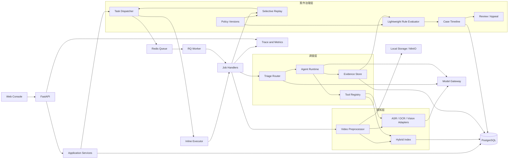

# EviStream 开发文档

> Evidence-Grounded Investigation Agent for Long-Form Video Moderation  
> 文档版本：v0.6
> 规划日期：2026-08-31  
> 目标版本：GitHub Release v0.1.0  
> GitHub 仓库：[https://github.com/linlin-is-me/EviStream.git](https://github.com/linlin-is-me/EviStream.git)

## 1. 项目摘要

EviStream 是一个面向长视频内容审核的多模态证据调查智能体。系统接收离线视频或模拟视频流，抽取镜头、语音、画面文字和视觉描述。低成本筛选器先定位疑似风险片段，Agent 随后按照审核规则制定调查计划，调用检索与视觉核验工具，收集支持证据、反证和缺失信息，最终输出带时间戳的审核建议。

项目同时提供案件管理、人工复核、申诉和规则变更后的增量重审。系统的主要差异位于案件治理层：Agent 负责调查，轻量规则判定器负责输出建议，人工审核员保留最终处理权。首个版本服务于个人求职展示，重点证明 Agent 应用研发、多模态处理、后端工程、评测和开源协作能力，不以论文投稿或训练新的基础模型为目标。

最终交付物必须是一个公开、可复现、可演示的 GitHub 仓库。任何开源代码、模型和数据集都要保留来源、许可证与修改说明。

## 2. 项目目标

### 2.1 业务目标

项目模拟短视频平台、直播平台和视频广告团队的内容审核流程，解决以下问题：

1. 审核长视频时，风险证据可能分散在相距较远的片段中。
2. 全量调用大型视觉模型成本较高，需要先筛选再调查。
3. 单次模型判断难以解释，人工审核员需要时间戳、画面、字幕和规则依据。
4. 证据不足或存在矛盾时，系统应转交人工，而不是强行输出确定结论。
5. 审核规则发生变化后，需要重审相关案件，同时避免重新处理全部视频。

### 2.2 工程目标

首个公开版本应当证明以下能力：

- 使用状态机组织可暂停、可恢复、可追踪的 Agent 工作流。
- 为 ASR、OCR、视频检索和视觉核验设计统一工具协议。
- 使用异步任务处理耗时的视频预处理与模型调用。
- 实现轻量缓存、任务去重、有限重试、预算限制和明确终止状态。
- 保存案件、证据、工具调用、所用模型和审核结果。
- 提供人工复核、申诉与规则重放接口。
- 使用公共数据和自建业务标注进行自动评测。
- 使用 Docker Compose 完成一键部署。
- 使用 GitHub Actions 完成静态检查、测试和构建。

### 2.3 开发原则

- 先完成视频输入到案件结论的纵向闭环，再补充工具、页面和评测。
- 鲁棒性优先依靠显式状态、数据库唯一约束、有限重试和人工降级，不追求分布式系统中的严格一次执行。
- 内容哈希、完整版本快照、复杂依赖图和生产级审计链均为可选增强，不作为 v0.1.0 的前置条件。
- Stage 0 允许单进程和 Mock；从 Stage 1 开始使用 PostgreSQL 保存可靠状态，媒体仍可保存在本地目录。Redis 队列在主流程稳定后接入，同步执行器始终保留。
- 外部模型或数据不可用时，系统应切换 Mock、字幕模式或授权样例，不阻塞核心功能开发。
- 许可证、密钥管理、路径安全和数据授权属于必要约束，不因提速而省略。
- 指标目标用于指导优化。只要核心流程完整、结果真实且限制说明清楚，未达到理想指标不阻塞首版发布。

### 2.4 完成标准

EviStream v0.1.0 达到以下条件后才视为完成：

1. 新用户按照 README 可以在 30 分钟内启动系统。
2. 用户上传 MP4 后能够查看处理进度和中间产物。
3. 至少三类审核规则能够完成端到端调查。
4. 用户无需修改代码即可配置兼容接口，并在任务中选择可用模型档案。
5. 每个结论都能回溯到规则版本、模型档案、证据时间段和主要工具调用。
6. 证据不足、预算耗尽和工具连续失败时能够稳定转人工。
7. 用户可以提交人工复核或申诉，并看到新旧结论差异。
8. 更新规则后能够只重跑受影响的案件或证据要求。
9. 仓库包含核心单元测试、一条集成测试、端到端冒烟测试和评测脚本。
10. 仓库包含架构图、演示 GIF 或视频、实验结果和开源来源说明。
11. 仓库不包含密钥、无授权数据、模型权重或无法公开的视频文件。
12. Agent 在节点边界中断后能够从最近检查点恢复，重复队列消息不会重复生成案件或结论。
13. 全新 Linux 环境能够使用 Docker Compose 启动 Mock Demo，容器重启后数据库和 Artifact 数据保持完整。

## 3. 项目边界

### 3.1 v0.1.0 必须实现

- MP4、MOV、MKV 文件上传。
- 使用固定长度切片模拟视频流逐段到达。
- 视频镜头切分、关键帧抽取和重复帧过滤。
- ASR、OCR 和基础视觉描述。
- 文本与视觉描述的混合检索。
- 三类可配置审核规则。
- 低成本风险筛选和疑难案件升级。
- Agent 调查、证据核验、反证搜索和预算控制。
- 通过、拒绝、转人工三种建议。
- 案件详情、证据时间线和工具轨迹展示。
- 人工复核、申诉和规则变更后的重审。
- 离线评测、成本统计和基础消融实验。
- Docker Compose 本地部署。

### 3.2 v0.1.0 明确不做

- 不训练或微调基础视觉语言模型。
- 不实现强化学习、SFT、DPO 或 GRPO。
- 不接入真实直播平台、推流鉴权和大规模 CDN。
- 不支持平台级高并发、多租户计费和复杂权限体系。
- 不部署 Kubernetes、Kafka、服务网格或多区域容灾。
- 不实现完整的自然语言政策编译器。
- 不引入 Neo4j 等图数据库；案件关系先使用 PostgreSQL 表达。
- 不覆盖全部内容安全类别。
- 不自动执行封禁、删除等不可逆操作。
- 不保存或展示模型隐藏思维链，只记录结构化动作、观察和决策依据。

### 3.3 首批审核规则

首个版本固定三类演示规则，规则通过 YAML 配置：

1. 暴力与武器展示。
2. 危险行为。
3. 烟酒等受限商品展示。

规则类别可在数据审计后替换，但总数保持为三类。每类规则至少准备一个明显违规、一个上下文例外和一个证据不足的演示案件。

### 3.4 后续版本候选

- v0.2：接入 HLS/RTSP 测试流和增量事件索引。
- v0.3：加入策略自然语言解析与审核规则编辑器。
- v0.4：加入租户、RBAC、审核队列和批量运营报表。
- v0.5：加入小模型蒸馏、主动学习或人工反馈训练。

后续版本不影响 v0.1.0 的完成判定。

## 4. 用户与核心流程

### 4.1 用户角色

- 内容审核员：查看案件、证据与建议，提交人工结论。
- 策略运营人员：创建规则版本，发起历史重审。
- 系统开发人员：查看 Agent 轨迹、性能、成本和失败原因。
- 内容申诉人员：提交补充说明，触发案件复核。

### 4.2 主流程

```text
上传视频
  -> 使用 ffprobe 校验视频并创建视频记录
  -> 创建异步预处理任务
  -> 镜头切分、ASR、OCR、关键帧与视觉描述
  -> 建立时间索引和向量索引
  -> 低成本筛选器生成风险候选
  -> 创建审核案件
  -> Agent 编译证据要求并规划调查
  -> 检索候选片段并执行局部视觉核验
  -> 搜索支持证据与反证
  -> 轻量规则判定器检查证据覆盖、冲突与预算
  -> 通过、拒绝或转人工
  -> 人工复核、申诉或规则更新
  -> 选择性重跑受影响案件
```

### 4.3 必须演示的三个案件

1. 明显案件：单个片段即可确认，低调用成本结束。
2. 跨片段案件：前后片段共同构成证据，Agent 至少执行两轮检索。
3. 不确定案件：证据冲突或缺失，系统转交人工；规则更新后触发增量重审。

## 5. 系统架构



感知层和调查层可以复用现有视频处理与长视频检索组件。案件治理层由本项目自主实现，集中处理规则版本、证据记录、人工复核、申诉和增量重审。v0.1.0 不建设复杂的策略依赖图，重审范围先按规则 ID 和证据要求类型计算。

架构采用模块化单体加独立 Worker。API、同步执行器和 RQ Worker 共享同一组 Application Services 与 Job Handlers，不复制业务逻辑。Application Services 负责事务边界和用例编排，领域模块负责规则、案件、证据和 Agent 状态；FastAPI、RQ、数据库、对象存储和模型供应商均属于外围适配器。

PostgreSQL 是视频处理状态、任务、Agent 运行、案件、证据和结论的持久化事实来源。Redis 只承担队列、短期任务通知和可丢失缓存，页面不能仅依赖 Redis 判断最终状态。视频、音频、关键帧和报告进入 Artifact Store；v0.1.0 的关键词索引与向量索引均落在 PostgreSQL 和 pgvector，避免再引入独立搜索服务。

### 5.1 服务划分

| 服务 | 职责 | v0.1 实现 |
|---|---|---|
| Web Console | 上传、案件列表、时间线、复核、规则管理 | React、TypeScript、Vite |
| API Server | REST API、鉴权占位、参数校验、任务提交 | FastAPI、Pydantic |
| Application Services | 视频接入、调查、复核和重放等用例编排；定义事务边界 | 普通 Python 服务，不依赖 Web 或队列框架 |
| Task Dispatcher | 将同一 Job Handler 交给同步执行器或异步队列 | `inline`、RQ 两种实现 |
| Worker | 执行视频预处理、模型调用、Agent 调查和重放 | RQ；只调用共享 Job Handler |
| PostgreSQL | 业务数据、证据元数据、模型和规则版本 | PostgreSQL 16、pgvector |
| Redis | 队列、短期任务状态和缓存 | Redis 7 |
| Artifact Store | 原视频、切片、关键帧、报告；统一 URI 与删除接口 | 默认本地目录；MinIO 为可选适配器 |
| Model Gateway | LLM、VLM 和嵌入模型的统一适配层 | 通用 OpenAI-compatible 适配器、用户配置和 Mock |
| Metrics | 调用次数、耗时、错误、预算 | 结构化日志；Prometheus 为可选项 |

### 5.2 技术选型原则

- 单机即可运行，默认不依赖付费云服务。
- 核心链路先采用最少服务数量，开发模式无需同时启动全部组件。
- 所有模型调用均经过适配层，允许替换本地模型或云 API。
- 用户通过配置文件或环境变量选择服务地址和模型，不把阿里云或任何单一供应商作为运行依赖。
- CI 使用 Mock Model Gateway，不调用真实模型。
- 数据库保存元数据，视频和图像进入对象存储。
- 业务状态使用显式枚举，避免由自然语言推断运行状态。
- Agent 负责任务规划和工具选择，轻量规则判定器负责汇总结构化条件；复杂或不确定案件交给人工。
- API 和 Worker 只能调用 Application Services，领域模块不直接依赖 FastAPI、RQ 或具体模型 SDK。
- 同步与异步模式使用同一 Job Handler、输入 Schema 和状态迁移，防止两条执行路径产生行为差异。
- 每个异步任务先在 PostgreSQL 创建记录并提交事务，再发送到 Redis；队列消息只携带任务 ID，Worker 重新读取数据库状态后执行。

### 5.3 任务编排与状态

首版定义三类长任务：`MEDIA_PREPROCESS`、`INVESTIGATION` 和 `POLICY_REPLAY`。API 只负责创建任务、校验请求和交给 `TaskDispatcher`；Job Handler 负责加载状态、执行步骤、保存结果和更新最终状态。

统一任务状态如下：

```text
PENDING -> RUNNING -> SUCCEEDED
                   -> RETRY_WAIT -> PENDING
                   -> FAILED
                   -> CANCELLED
```

每条任务至少保存 `job_id`、`job_type`、`subject_id`、`request_key`、`status`、`attempt`、`max_attempts`、`error_code`、`created_at`、`started_at` 和 `finished_at`。状态迁移由 Application Services 统一执行，API、Worker 和前端不能自行拼接状态。

JobStatus 只描述技术执行结果。调查正常完成但证据不足时，任务状态为 `SUCCEEDED`，案件或调查状态为 `NEEDS_HUMAN_REVIEW`；业务结论不能混入队列任务状态。

PostgreSQL 提交任务记录后再发送队列消息。发送失败时任务保留为 `PENDING`，启动检查或管理命令可以重新投递未运行任务；v0.1.0 不实现事务型 Outbox。Worker 收到重复消息时根据 `request_key` 和当前状态跳过已完成任务，运行中的任务使用有限租约避免永久占用。

### 5.4 部署平台与拓扑

EviStream v0.1.0 的正式运行目标是单台 Linux 主机。官方部署文档以 Ubuntu LTS 为准，开发阶段推荐 Windows WSL2；macOS 提供尽力兼容，Windows 原生运行不作为首版验收条件。经过实际验证的 Linux 发行版和版本号在发布时写入 `docs/deployment.md`，避免提前承诺未经测试的平台。

部署分为开发运行、完整演示和发布验收三种形态：

| 形态 | 运行方式 | 目的 |
|---|---|---|
| 开发运行 | API 和 InlineExecutor 直接运行；PostgreSQL 使用 Docker；Artifact Store 使用本地目录 | 快速调试媒体、规则和 Agent 主流程 |
| 完整演示 | Docker Compose 启动 Web、API、RQ Worker、PostgreSQL 和 Redis | 复现浏览器端完整业务流程 |
| 发布验收 | 在全新 Linux 环境从公开仓库启动完整演示 | 验证文档、迁移、镜像、健康检查和持久化卷 |

Docker Compose 包含以下服务：

- `web`：构建 React 静态页面并访问 API。
- `api`：运行 FastAPI，只处理短请求和任务提交。
- `worker`：运行 RQ Worker，执行共享 Job Handler。
- `postgres`：保存业务状态、pgvector 索引和数据库迁移结果。
- `redis`：保存队列和可丢失缓存，不作为业务事实来源。

原始视频、切片和关键帧默认挂载到具名卷或宿主机数据目录。开发模式使用 LocalArtifactStore；MinIO 仅作为可选适配器，不进入首版默认 Compose。使用云端模型 API 时，部署主机不需要 GPU；本地 ASR、OCR 或模型可以使用 CPU，GPU 镜像与本地大模型不作为 v0.1.0 发布条件。

部署配置遵守以下约束：

- `.env.example` 只保存变量名和安全默认值，真实密钥放入未跟踪的 `.env` 或部署平台密钥配置。
- API、Worker 和脚本读取同一配置 Schema，容器镜像不写入密钥和业务数据。
- PostgreSQL、Redis、API 和 Worker 配置健康检查；API 只有在数据库迁移完成后才接收业务请求。
- 数据库和 Artifact Store 使用持久化卷，容器重建不得删除业务数据。
- 日志输出到标准输出，案件轨迹和检查点仍写入 PostgreSQL。
- 默认只暴露 Web 和 API 端口；PostgreSQL 与 Redis 不直接开放到公网。

Makefile 计划提供以下稳定入口，底层命令可以随实现调整：

```text
make doctor        # 检查 Python、Node、FFmpeg、Docker 和配置
make dev-infra     # 启动 PostgreSQL 等当前阶段所需基础设施
make dev-api       # 启动 API 和同步执行器
make demo-up       # 构建并启动完整 Docker Compose
make demo-down     # 停止服务但保留持久化数据
make verify-deploy # 迁移、健康检查和 Mock 冒烟测试
```

公网部署不是 v0.1.0 的强制条件。需要在线演示时，可以将完整 Compose 部署到一台 Linux 云主机，并在 Web 与 API 前增加 Caddy 或 Nginx 提供 TLS；首版不承诺高可用、自动扩缩容、生产级鉴权和互联网暴露后的安全运维能力。

## 6. 视频处理流水线

### 6.1 输入校验

上传阶段完成以下基础检查：

- 扩展名和 MIME 只做快速检查，最终以 ffprobe 能否解析为准。
- 使用 ffprobe 检查时长、分辨率、编码和音轨。
- 文件大小、视频时长和最大分辨率采用可配置限制，开发模式允许放宽。
- 默认按数据库视频 ID 管理文件；需要去重时再计算快速指纹或 SHA-256。
- 为所有临时路径生成服务器端 ID，禁止直接使用用户文件名拼接路径。

默认限制：单文件不超过 2 GB，时长不超过 60 分钟。LongVidSearch 等评测任务可以通过管理员配置放宽。

### 6.2 镜头与模拟流

- 离线模式使用 PySceneDetect 或 FFmpeg scene filter 划分镜头。
- 模拟流模式将视频按 10 秒分片，按时间顺序提交到队列。
- 每个镜头保留开始时间、结束时间、关键帧和父视频 ID。
- 使用 pHash 或视觉嵌入过滤近重复帧。
- 所有时间统一保存为毫秒整数，显示层再格式化。

### 6.3 多模态抽取

| 模态 | 默认工具 | 输出 |
|---|---|---|
| 语音 | faster-whisper | 带词级或句级时间戳的转写 |
| OCR | PaddleOCR | 文本、位置、置信度、帧时间 |
| 镜头 | FFmpeg、PySceneDetect | 镜头边界、关键帧 |
| 视觉描述 | VLM Adapter | 对象、动作、场景和不确定性 |
| 文本嵌入 | 可替换 Embedding Adapter | 字幕、OCR、描述向量 |
| 视觉嵌入 | CLIP 或兼容适配器 | 关键帧向量 |

抽取结果保存工具名称、模型名称、参数摘要和来源片段。模型版本和内容指纹在接口能够稳定提供时记录，不要求所有适配器强制返回。

### 6.4 模型角色与调用策略

首版实现供应商无关的 `OpenAICompatibleGateway`。用户自行配置兼容接口的 `base_url`、API Key 环境变量和模型 ID；同一个模型可以承担全部角色，也可以分别配置规划、初筛、核验和评测模型。系统不为不同供应商复制业务代码。

| 角色 | 职责 | 用户配置项 | 项目测试模型 |
|---|---|---|---|
| Agent Planner | 证据要求拆解、查询改写、工具选择和停止判断 | `EVISTREAM_AGENT_MODEL` | `qwen3.8-flash` |
| Triage VLM | 低成本风险初筛和简单片段检查 | `EVISTREAM_TRIAGE_MODEL` | `qwen3-vl-flash-2026-01-22` |
| Verify VLM | 疑难片段、反证和上下文例外核验 | `EVISTREAM_VERIFY_MODEL` | `qwen3-vl-plus-2025-12-19` |
| Evaluation Judge | 离线评估解释质量 | `EVISTREAM_JUDGE_MODEL` | `qwen3.8-max` |
| Mock Gateway | CI、无密钥演示和故障注入 | `EVISTREAM_MODEL_PROFILE=mock` | 固定本地响应 |

项目开发和公开结果使用阿里云百炼作为参考测试环境，但这只是测试配置。`qwen3.8-flash` 支持文本、图像和视频输入；`qwen3-vl-flash` 与 `qwen3-vl-plus` 用于测试低成本初筛、疑难案件核验的两级调用。相关模型信息参考[阿里云百炼视觉模型文档](https://help.aliyun.com/en/model-studio/model-list-visual-understanding/)和[OpenAI-compatible 接口文档](https://help.aliyun.com/en/model-studio/qwen-api-via-openai-chat-completions)。

通用用户配置：

```yaml
gateway:
  provider: openai_compatible
  base_url_env: EVISTREAM_MODEL_BASE_URL
  api_key_env: EVISTREAM_MODEL_API_KEY

models:
  agent_env: EVISTREAM_AGENT_MODEL
  triage_env: EVISTREAM_TRIAGE_MODEL
  verifier_env: EVISTREAM_VERIFY_MODEL
  judge_env: EVISTREAM_JUDGE_MODEL

runtime:
  temperature: 0
  structured_output: true
  fallback_to_mock: true
  video_input: sampled_frames
```

阿里云测试配置放在 `configs/models/dashscope-test.yaml`，用户模板放在 `configs/models/custom-openai.yaml`。`.env.example` 只包含变量名和占位符：

```dotenv
EVISTREAM_MODEL_PROFILE=custom-openai
EVISTREAM_MODEL_BASE_URL=https://your-provider.example/v1
EVISTREAM_MODEL_API_KEY=
EVISTREAM_AGENT_MODEL=your-text-or-multimodal-model
EVISTREAM_TRIAGE_MODEL=your-vision-model
EVISTREAM_VERIFY_MODEL=your-vision-model
EVISTREAM_JUDGE_MODEL=your-judge-model
```

用户可以让四个角色共用同一模型。系统启动时加载 `configs/models/*.yaml` 中可用的模型档案，上传视频或启动调查时由用户选择 `model_profile`；未指定时使用环境变量中的默认档案。没有独立 Judge 时，评测解释质量可以跳过；没有视频文件输入能力时，Gateway 发送预先抽取的帧列表，降低不同供应商之间的协议差异。前端只展示档案名称、供应商地址域名、模型名称和能力，不读取、保存或显示 API Key。v0.1.0 不允许通过公开 API 直接提交任意密钥，用户在本地 `.env` 中配置后重启服务即可。

调用约束：

- Stage 0 先跑通通用 Gateway 和 Mock。项目参考测试使用 `qwen3.8-flash`，主流程稳定后再验证阿里云 Flash、Plus 两级视觉路由。
- Agent Planner 只接收规则、案件摘要和已检索证据，不直接读取完整视频。
- Triage VLM 读取关键帧、字幕和视觉描述；Verify VLM 读取 Agent 选出的短片段或有限帧序列。
- Planner 输出 `next_action`、`tool_name`、`query`、`target_requirement_id` 和 `stop_reason` 等结构化字段。
- VLM 输出观察、证据时间段、支持立场、置信度和不确定原因，不直接生成最终业务处置。
- Evaluation Judge 只评估解释质量，Macro-F1、证据召回和时间 IoU 使用人工标注直接计算，避免同一模型既答题又判分。
- 用户模型只需满足当前角色要求的文本或视觉输入与结构化文本输出。启动时执行一次能力探测，缺少可选能力时给出提示或降级，不设置供应商品牌白名单。
- 开发配置可以使用滚动模型别名；正式评测保存供应商、API 地址域名、实际模型 ID 和运行日期，不要求为日常开发建立复杂的版本锁定机制。
- 模型限流、超时或密钥缺失时切换 Mock 或字幕模式，案件进入可解释的降级状态。

Model Gateway 对业务层提供统一的内部契约。请求包含模型角色、文本消息、有限数量的图像或视频片段、目标输出 Schema、超时和追踪 ID；响应包含解析后的结构化结果、实际模型 ID、Token 用量、耗时、结束原因和供应商请求 ID。供应商异常统一映射为 `MODEL_TIMEOUT`、`MODEL_RATE_LIMITED`、`MODEL_OUTPUT_INVALID` 和 `MODEL_UNAVAILABLE`。重试、退避和结构化输出校验集中在 Gateway，Agent 节点不直接处理各供应商协议。

能力探测只检查当前档案是否支持文本、图像、视频和结构化输出。缺少原生视频能力时发送抽取帧；缺少原生 JSON Schema 时使用 JSON 文本解析和 Pydantic 校验。业务模块只依赖统一响应，不根据供应商名称分支。

### 6.5 混合索引

首个版本支持：

- 字幕与 OCR 的关键词检索。
- 字幕、OCR、视觉描述的向量检索。
- 按时间范围过滤。
- 相邻片段扩展。
- 关键词结果与向量结果使用 Reciprocal Rank Fusion 进行简单融合，避免直接相加不同量纲的分数。

索引的基本单元为 `SearchDocument`，包含视频、片段、时间范围、模态、规范化文本、向量和来源 Artifact。字幕、OCR 和视觉描述共用检索接口，但保留各自模态和来源。首版使用 PostgreSQL 全文检索与 pgvector，不实现复杂的事件知识图；需要表达跨片段关系时，由案件证据表记录关系。

## 7. 审核规则设计

### 7.1 规则文件

```yaml
id: restricted.weapon.display
version: 1
name: 武器展示审核
enabled: true
severity: high
trigger_terms:
  - 枪
  - 刀具
  - weapon
requirements:
  - id: visual_presence
    type: visual_presence
    required: true
    description: 画面中是否出现受限武器
  - id: action_context
    type: temporal_context
    required: true
    description: 是否存在展示、使用或威胁行为
exceptions:
  - news_report
  - educational_context
decision:
  reject_when:
    all:
      - visual_presence
      - action_context
  escalate_when:
    any:
      - unresolved_exception
      - contradictory_evidence
```

### 7.2 规则编译

`PolicyCompiler` 只完成轻量、可测试的转换：

1. 校验 YAML Schema。
2. 将 requirements 转换为 `EvidenceRequirement` 对象。
3. 生成建议检索词和工具能力需求。
4. 记录规则版本。
5. 构造轻量规则判定器可执行的布尔条件。

`requirements` 和 `exceptions` 都编译为显式 `EvidenceRequirement`。例外条件使用独立 ID，例如 `exception.news_report`，不得只保留在提示词中。规则条件只引用规范化后的 RequirementResult，不直接读取模型自由文本或置信度。

LLM 可以补充检索词，但不能直接修改已发布规则中的强制条件和例外。

### 7.3 版本管理

- 开发中的草稿可以直接修改；进入演示或评测的规则保存为新版本。
- 每个案件绑定创建时的规则版本。
- 重审任务显式指定目标版本。
- 系统展示旧版本与新版本的条件差异、证据复用情况和结论变化。

### 7.4 选择性重放与失效规则

`ReplayPlanner` 比较两个规则版本，输出受影响案件、执行模式、失效原因和预计复用内容。首版支持两种执行模式：

- `REEVALUATE`：只修改严重等级、布尔判定条件或阈值，证据要求的语义没有变化。系统复用已有 Evidence 和 RequirementResult，只重新运行聚合器与规则判定器。
- `REINVESTIGATE`：新增、删除或修改证据要求与例外条件。系统复用视频切片、ASR、OCR、视觉描述和索引，对变化的证据要求重新执行 Agent 调查。

原始媒体或 Artifact 缺失时，对应证据不得复用。用户主动更换核验模型时，可以选择保留旧证据用于对照，或者将相关视觉 RequirementResult 标记为 `UNKNOWN` 后重新核验。改变镜头切分、ASR、OCR 或嵌入配置属于媒体重新处理，不由普通规则重放自动触发。

重放创建前先返回预览，列出受影响案件数量、执行模式、可复用证据数量和预计需要重新核验的条件。执行完成后保存旧结论、新结论、复用证据、失效证据和变化原因。

## 8. Agent Runtime

### 8.1 Agent 状态

```python
class InvestigationState:
    run_id: str
    job_id: str
    case_id: str
    policy_id: str
    policy_version: int
    model_profile: str
    requirements: list[EvidenceRequirement]
    hypotheses: list[Hypothesis]
    selected_segment_ids: list[str]
    evidence_ids: list[str]
    missing_requirement_ids: list[str]
    contradictory_requirement_ids: list[str]
    iteration: int
    vlm_calls: int
    tool_failures: int
    elapsed_ms: int
    current_node: str
    next_node: str | None
    state_version: int
    deadline_at: datetime
    last_checkpoint_at: datetime | None
    status: str
```

### 8.2 状态节点

| 节点 | 输入 | 输出 |
|---|---|---|
| Triage | 视频摘要、规则触发项 | 跳过、建案或直接转人工；被跳过样本可配置抽检 |
| Plan | 规则和当前证据 | 待核验条件、查询和工具计划 |
| Retrieve | 查询、时间约束 | 候选片段 |
| Inspect | 候选片段、检查目标 | 结构化视觉观察 |
| Verify | 证据要求、观察 | 支持、反驳、无关或不确定 |
| Challenge | 初步结论 | 反证查询和例外条件检查 |
| Decide | 完整案件状态 | 通过、拒绝或转人工 |
| Persist | 动作和结果 | 数据库记录、轨迹和指标 |

Agent Runtime 在每个节点成功结束后保存检查点，检查点包含状态快照、当前节点、下一节点、预算消耗和状态版本。Worker 中断后只从最近成功节点继续，不重复提交已经持久化的证据。状态更新使用 `run_id + state_version` 做轻量乐观并发检查，发现同一运行存在另一个活跃执行者时安全退出，不实现分布式锁服务。

v0.1.0 使用普通 Python 实现轻量显式状态机，不把 LangGraph 设为运行依赖。`graph.py` 保存允许的节点转移和执行循环，LLM 只提出下一动作、工具和查询，Runtime 校验节点转移、工具白名单、预算和停止条件。状态 Schema、检查点、工具注册和轨迹记录均由项目自主实现；后续需要接入 LangGraph 时，只替换 `AgentRuntime` 适配器，不改动 API 和领域模型。

### 8.3 调查循环

```text
Plan
  -> Retrieve
  -> Inspect
  -> Verify
  -> Challenge
  -> Evidence complete ? Decide : Plan
```

建议的默认预算，可在配置文件中调整：

- 最大循环次数：6。
- 最大 VLM 调用次数：8。
- 最大连续工具失败次数：3。
- 单案件最大运行时间：300 秒。
- 连续两轮没有新增有效证据时停止。

预算耗尽、必要条件缺失、关键证据冲突或工具连续失败时，系统结束自动调查并返回 `NEEDS_HUMAN_REVIEW`，不继续无上限重试。

### 8.4 工具协议

所有 Agent 工具实现统一接口：

```python
class ToolRequest(BaseModel):
    correlation_id: str
    run_id: str
    case_id: str
    requirement_id: str
    query: str
    start_ms: int | None = None
    end_ms: int | None = None
    limit: int = 5

class ToolItem(BaseModel):
    source_ref: str
    artifact_id: str | None = None
    modality: str
    start_ms: int
    end_ms: int
    content: str
    score: float | None = None

class ToolResult(BaseModel):
    tool_run_id: str
    request_key: str
    status: Literal["success", "partial", "failed"]
    items: list[ToolItem]
    latency_ms: int
    estimated_cost: float
    error_code: str | None = None
```

首批工具：

- `search_transcript`
- `search_ocr`
- `search_visual_caption`
- `inspect_clip`
- `expand_temporal_context`
- `get_neighbor_segments`
- `find_counter_evidence`
- `get_policy_requirement`

工具应尽量保持无副作用。首版使用 `case_id + tool_name + 规范化参数` 生成请求键，避免同一调查循环中的明显重复调用；缓存失效时允许安全重算，不实现严格的分布式幂等协议。

### 8.5 证据结构

```json
{
  "evidence_id": "ev_01",
  "case_id": "case_01",
  "requirement_id": "visual_presence",
  "stance": "support",
  "modality": "vision",
  "start_ms": 124000,
  "end_ms": 131000,
  "artifact_id": "artifact_clip_08",
  "artifact_uri": "artifact://clips/case_01/clip_08.mp4",
  "summary": "局部画面出现疑似受限物品",
  "confidence": 0.82,
  "tool_name": "inspect_clip",
  "tool_run_id": "tool_run_08",
  "model_call_id": "model_call_08",
  "model_name": "configured-vlm",
  "source_ref": "segment_08"
}
```

`stance` 仅允许 `support`、`contradict`、`neutral`、`uncertain`。结论不得引用没有时间范围和来源的自由文本。

### 8.6 证据聚合协议

Agent 和工具只产生 Evidence，普通代码将同一证据要求下的有效证据聚合为 RequirementResult：

- `SATISFIED`：存在达到最低质量要求的支持证据，且没有未解决的关键反证。
- `NOT_SATISFIED`：完成规定检查范围后，反证成立或必要事实明确不成立。
- `CONFLICTED`：支持与反证同时存在，无法按照规则优先级消解。
- `UNKNOWN`：尚未检查、证据不足、工具失败或模型输出无效。

聚合器先检查来源、时间范围、模态、工具状态和规则要求，再执行可配置的最低置信度与证据数量条件。置信度只参与单条证据质量过滤，不直接作为最终业务概率。每次聚合保存使用的 Evidence ID、聚合版本和理由码，保证相同输入可以重复计算。

### 8.7 轻量规则判定器

判定器使用普通代码汇总结构化条件，主要规则如下：

- 所有拒绝条件对应的 RequirementResult 均为 `SATISFIED`，且所有例外条件均为 `NOT_SATISFIED` 时，可以建议拒绝。
- 所有强制检查项均得到明确结果，拒绝条件不成立且不存在未解决例外时，可以建议通过。
- 任一强制条件为 `UNKNOWN` 或 `CONFLICTED`，或者预算耗尽、关键工具失败时，建议转人工。
- 每个结论至少绑定规则版本和证据 ID；Agent、工具和模型版本能获取时一并记录。
- Agent 生成面向审核员的说明，判定器负责输出结构化建议，人工复核可以修改结论。

## 9. 数据模型

| 表 | 关键字段 | 作用 |
|---|---|---|
| videos | id、fingerprint、duration、status | 原视频和处理状态；fingerprint 可为空 |
| segments | video_id、start_ms、end_ms | 镜头或模拟流片段 |
| artifacts | video_id、segment_id、type、uri、metadata | 帧、音频、字幕和切片 |
| search_documents | video_id、segment_id、modality、text、embedding | 全文与向量检索单元 |
| processing_jobs | type、subject_id、request_key、status、attempt、lease_until | 媒体、调查和重放任务的可靠状态 |
| policies | policy_id、version、yaml | 审核规则版本 |
| cases | video_id、policy_id、policy_version、model_profile、status | 审核案件及其模型档案 |
| requirements | case_id、type、required、status | 案件证据要求 |
| evidence | requirement_id、stance、time、artifact_id、tool_run_id | 支持证据和反证 |
| requirement_results | requirement_id、status、evidence_ids、reason_code | 确定性的证据聚合结果 |
| agent_runs | case_id、job_id、current_node、state_snapshot、state_version、status | Agent 运行与最近检查点 |
| agent_steps | run_id、node、iteration、input、output、status | 节点级轨迹和恢复依据 |
| tool_runs | run_id、case_id、tool、request_key、status、cost | 工具调用轨迹 |
| model_calls | job_id、run_id、role、profile、model、status、usage | 模型调用、成本和错误记录；run_id 可为空 |
| decisions | case_id、verdict、reason_code、metadata | 机器或人工结论 |
| reviews | case_id、reviewer、decision、note | 人工复核 |
| appeals | case_id、statement、status | 申诉信息 |
| replay_jobs | processing_job_id、source_version、target_version、mode | 规则重审范围与运行模式 |
| metrics | run_id、name、value、tags | 评测和运行指标 |

所有核心表包含 `created_at` 和 `updated_at`。决策、证据、RequirementResult、规则版本和 Agent Step 使用追加写入，不覆盖历史记录。大体积帧、音频和视频不进入数据库，只保存 Artifact URI 与必要元数据。

状态字段使用独立枚举，至少区分 `VideoStatus`、`JobStatus`、`CaseStatus`、`InvestigationStatus`、`RequirementStatus` 和 `Verdict`。数据库约束只保护关键不变量，例如唯一请求键、合法时间范围和版本唯一性；复杂状态迁移由 Application Services 负责。

## 10. API 设计

### 10.1 视频与任务

- `POST /api/v1/videos`：上传视频，可指定已经配置的 `model_profile`。
- `GET /api/v1/videos/{video_id}`：查询视频及处理状态。
- `POST /api/v1/videos/{video_id}/simulate-stream`：启动模拟流。
- `GET /api/v1/jobs/{job_id}`：查询异步任务。
- `POST /api/v1/jobs/{job_id}/retry`：重试失败任务。

### 10.2 案件

- `GET /api/v1/cases`：筛选案件列表。
- `GET /api/v1/cases/{case_id}`：读取案件、要求和结论。
- `POST /api/v1/cases/{case_id}/investigate`：开始或恢复调查。
- `GET /api/v1/cases/{case_id}/timeline`：读取证据时间线。
- `GET /api/v1/cases/{case_id}/trace`：读取结构化 Agent 轨迹。

### 10.3 人工复核与申诉

- `POST /api/v1/cases/{case_id}/reviews`
- `POST /api/v1/cases/{case_id}/appeals`
- `POST /api/v1/cases/{case_id}/appeals/{appeal_id}/resolve`

### 10.4 规则与重放

- `POST /api/v1/policies`
- `GET /api/v1/policies/{policy_id}/versions`
- `POST /api/v1/policies/{policy_id}/replay/preview`：计算影响范围、执行模式和复用情况，不创建任务。
- `POST /api/v1/policies/{policy_id}/replay`：确认预览后创建重放任务。
- `GET /api/v1/replay-jobs/{job_id}`
- `GET /api/v1/replay-jobs/{job_id}/diff`

### 10.5 模型档案

- `GET /api/v1/model-profiles`：列出可选档案、模型名称和能力，不返回密钥。
- `GET /api/v1/model-profiles/{profile}/health`：执行轻量能力检查。
- 调查和重放请求可以指定已配置的 `model_profile`；若档案不可用，任务返回明确错误或切换 Mock。

OpenAPI 文档由 FastAPI 自动生成，README 中提供主要请求示例。

## 11. 前端范围

首个版本交付三个主界面，可以在路由层拆成五个页面：

1. 任务中心：视频上传、模型档案选择、处理进度、重试次数、错误原因和案件列表。
2. 案件工作台：视频播放器、证据时间线、RequirementResult、Agent 节点轨迹、人工复核和申诉。
3. 规则与重放：规则版本、影响预览、复用与失效数据、重放进度和结论差异。

案件详情页是主要演示页面，应支持点击证据后跳转到对应视频时间，展示字幕、OCR、截图、证据立场、工具和可获得的模型信息。

前端不开发复杂视觉设计、国际化、移动端适配和完整权限后台。

## 12. 开源项目复用方案

### 12.1 计划复用

| 项目 | 许可证 | 复用内容 | 处理方式 |
|---|---|---|---|
| [LongVidSearch](https://github.com/yrywill/LongVidSearch) | MIT | 数据接口、检索工具形式、评测思路 | 作为数据与基线适配器 |
| [VideoHV-Agent](https://github.com/Haorane/VideoHV-Agent) | Apache-2.0 | 假设核验流程参考 | 不复制核心编排；必要代码保留声明 |
| [Project-Ava](https://github.com/I-ESC/Project-Ava) | MIT | 超长视频事件索引基线 | 默认不进入运行依赖 |
| [AWS Video Compliance Agent](https://github.com/aws-samples/sample-video-compliance-agent) | 以仓库 LICENSE 为准 | FFmpeg、pHash、报告结构参考 | 只移植独立模块，删除 AWS 耦合 |

### 12.2 必须自主实现

- Application Services、TaskDispatcher 和共享 Job Handler。
- EviStream Agent 状态定义与恢复机制。
- Tool Registry 和统一工具协议。
- Model Gateway 内部契约、能力降级和错误映射。
- 审核规则 Schema、版本管理和轻量规则判定器。
- Evidence Store、RequirementResult 聚合器、案件状态和证据时间线。
- 反证查询、预算管理和停止条件。
- 人工复核、申诉、ReplayPlanner 与选择性重放失效规则。
- API、前端、异步任务和可观测性。
- 评测框架、业务测试集和消融实验。

### 12.3 开源合规

- 仓库许可证建议使用 Apache-2.0。
- 新建 `THIRD_PARTY_NOTICES.md`，记录项目、URL、许可证、使用文件和修改内容。
- 复制代码时保留原版权头和许可证要求。
- 在 `docs/reuse-boundary.md` 中区分复用模块与个人实现模块。
- 记录复用项目的版本、标签或 commit；不要求锁定全部间接依赖。
- 数据下载脚本只下载公开允许的数据，不重新分发受限视频。
- 发布前再次检查每个依赖和数据集的许可证；无法确认时只提供用户自行配置的接口。

## 13. 仓库结构

```text
evistream/
├── README.md
├── LICENSE
├── NOTICE
├── THIRD_PARTY_NOTICES.md
├── CONTRIBUTING.md
├── CODE_OF_CONDUCT.md
├── SECURITY.md
├── CHANGELOG.md
├── pyproject.toml
├── docker-compose.yml
├── .env.example
├── Makefile
├── .github/
│   ├── workflows/
│   │   ├── ci.yml
│   │   ├── docker.yml
│   │   └── release.yml
│   ├── ISSUE_TEMPLATE/
│   └── pull_request_template.md
├── apps/
│   ├── api/
│   ├── worker/
│   └── web/
├── evistream/
│   ├── application/
│   │   ├── services.py
│   │   ├── dispatcher.py
│   │   └── job_handlers.py
│   ├── agent/
│   │   ├── state.py
│   │   ├── graph.py
│   │   ├── checkpoint.py
│   │   ├── planner.py
│   │   ├── verifier.py
│   │   ├── challenger.py
│   │   └── rule_evaluator.py
│   ├── tools/
│   ├── policies/
│   ├── evidence/
│   ├── replay/
│   ├── media/
│   ├── retrieval/
│   ├── models/
│   ├── storage/
│   ├── observability/
│   └── evaluation/
├── migrations/
├── configs/
│   ├── policies/
│   ├── models/
│   │   ├── custom-openai.yaml
│   │   ├── dashscope-test.yaml
│   │   └── mock.yaml
│   └── demo/
├── scripts/
│   ├── download_data.py
│   ├── build_fixtures.py
│   ├── prepare_longvidsearch.py
│   ├── prepare_harmful_contents.py
│   ├── validate_case_manifest.py
│   ├── seed_demo.py
│   ├── run_eval.py
│   └── export_report.py
├── tests/
│   ├── unit/
│   ├── contract/
│   ├── integration/
│   ├── e2e/
│   └── fixtures/
├── benchmarks/
│   ├── manifests/
│   ├── baselines/
│   └── results/
├── docs/
│   ├── architecture.md
│   ├── task-runtime.md
│   ├── agent-runtime.md
│   ├── evidence-model.md
│   ├── policy-format.md
│   ├── data.md
│   ├── evaluation.md
│   ├── reuse-boundary.md
│   ├── deployment.md
│   ├── demo-script.md
│   └── adr/
└── assets/
    ├── architecture.svg
    └── demo.gif
```

## 14. 测试与评测

### 14.1 测试优先级

v0.1.0 先覆盖会导致主流程中断、数据重复或结论不可解释的问题。适配器的全部边界情况、并发压力和跨平台矩阵放入后续增强，不要求首版一次完成。

#### 单元测试

- 规则 Schema 和主要判定分支。
- Evidence 到 RequirementResult 的聚合分支。
- Agent 预算和停止条件。
- 任务状态迁移和 Agent 检查点恢复。
- 时间范围合并与片段扩展。
- 文件路径和主要输入格式。
- 选择性重放的影响范围与失效规则。

#### 契约测试

- 首个真实模型适配器和 Mock 适配器返回统一 Schema。
- Model Gateway 的能力探测、错误映射和结构化输出校验。
- 首批核心 Agent 工具满足 ToolRequest 和 ToolResult。
- Mock Gateway 与真实 Gateway 的字段一致。
- 数据库迁移能够从空库执行。

#### 集成测试

- 一条视频上传到预处理完成的主路径。
- 一条筛选器建案到 Agent 决策的主路径。
- 工具超时、任务失败重试和重复队列消息。
- 同步执行器与 RQ Worker 对同一 Job Handler 产生一致结果。
- Agent 节点执行后中断并从最近检查点恢复。
- 人工复核与申诉。
- 规则更新与选择性重放。

#### 端到端测试

- 使用 30 至 60 秒的小型授权视频完成浏览器操作。
- CI 默认使用 Mock Model Gateway，确保无密钥也能运行。
- 真实模型测试由手动 GitHub Action 或本地命令触发。
- 发布前在 Linux 中运行完整 Compose 冒烟测试，覆盖迁移、健康检查、上传、任务执行和容器重启。

### 14.2 数据计划

| 数据 | 用途 | 处理原则 |
|---|---|---|
| EviStream-Fixtures-18 | CI、无密钥演示和端到端测试 | 18 个完全授权短视频随仓库或 Release 发布，总体积尽量控制在 200 MB 内 |
| CaseReplay-48 | 规则、证据、反证、申诉和重放 | 48 条案件记录复用 Fixtures 视频和不同规则版本，发布完整清单 |
| [LongVidSearch](https://huggingface.co/datasets/Fishiing/LongVidSearch) 字幕模式 | Agent 多跳检索、证据召回和工具成本 | 从官方 3,000 个问答中固定抽取 120 个，不强制下载原始视频 |
| [Harmful-Contents](https://huggingface.co/datasets/onullusoy/harmful-contents) | 暴力、武器、吸烟和酒精识别 | 从 5,153 张图片中固定抽取约 300 张；仅提供下载和视频构造脚本 |
| [Video-SafetyBench](https://github.com/flageval-baai/Video-SafetyBench) | 可选的外部视频安全鲁棒性评测 | 获得访问许可后抽取约 120 个相关视频；不重新分发原始数据 |
| [AVA-100](https://huggingface.co/datasets/iesc/Ava-100) | 可选的超长视频压力测试 | 约 30.4 GB，不进入首版安装、CI 和发布阻塞路径 |

#### 14.2.1 EviStream-Fixtures-18

每类审核规则准备六个 30 至 90 秒短视频：

- 2 个直接证据视频。
- 2 个跨片段视频。
- 1 个上下文例外视频。
- 1 个证据不足或冲突视频。

三类规则共 18 个视频。素材可以来自自录内容、明确授权素材或 Harmful-Contents 图片，使用 `scripts/build_fixtures.py` 添加正常过渡片段、字幕和 TTS 语音并调用 FFmpeg 自动合成。仓库只分发自行制作或允许再分发的媒体；受限素材只提供本地生成脚本。

#### 14.2.2 CaseReplay-48

CaseReplay-48 不要求准备 48 个独立视频。18 个 Fixtures 视频可以在不同规则版本、人工复核和申诉条件下形成多个案件：

- 三类规则各 16 个案件。
- 每类包含 4 个直接证据、4 个跨片段、4 个上下文例外、4 个证据不足或冲突案件。
- 48 条案件记录全部具有参考结论；其中至少 18 条黄金案件由人工核对完整时间段、反证和转人工原因。
- 其余案件可以复用相同视频，改变规则版本、证据要求或申诉信息，用于测试选择性重放。

案件清单保存在 `benchmarks/manifests/cases.jsonl`，最小结构如下：

```yaml
case_id: weapon_case_01
video: fixtures/weapon_cross_01.mp4
policy_id: restricted.weapon.display
policy_version: 1
expected_verdict: NEEDS_HUMAN_REVIEW
evidence:
  - start_ms: 12000
    end_ms: 18000
    requirement_id: visual_presence
    stance: support
counter_evidence:
  - start_ms: 31000
    end_ms: 38000
    requirement_id: educational_context
    stance: support
reason: 疑似武器，但存在影视道具说明
```

模型可以生成标注初稿，`scripts/validate_case_manifest.py` 检查字段、时间范围和引用视频是否存在；发布用黄金案件必须经过人工观看确认。

#### 14.2.3 公共数据子集

- LongVidSearch-120：二跳、三跳、四跳问题各 40 个。只评估检索计划、必要证据召回和工具调用数，不计算审核准确率。
- Harmful-Contents-300：优先抽取暴力、武器、吸烟、酒精及易混淆安全负样本。该数据不能覆盖危险行为，危险行为由 Fixtures 补充。
- Video-SafetyBench-120：只作为外部补充。其任务更偏向视频大模型安全响应，不取代 EviStream 的案件审核指标。
- AVA-100：只在时间和磁盘允许时运行长视频压力测试。

`docs/data.md` 必须记录数据来源、许可证、抽样规则、可否重新分发和准备命令。下载失败或权限未获批准时，跳过对应可选评测，不阻塞 v0.1.0。

### 14.3 基线

- B0：均匀采样关键帧加单次 VLM 判断。
- B1：关键词和向量 Top-K 检索加单次 VLM 判断。
- B2：LongVidSearch 风格的基础 ReAct Agent。
- B3：EviStream 去除 Triage。
- B4：EviStream 去除反证搜索。
- B5：EviStream 去除缓存与选择性重放。

### 14.4 指标

#### 证据指标

- 必要证据 Recall@K。
- 证据时间段 IoU。
- 反证召回率。
- 证据要求覆盖率。
- 无来源结论率。

#### 决策指标

- Macro-F1。
- 固定召回率下的误判率。
- 转人工比例。
- 证据不足案件的正确转人工率。
- 人工与系统结论一致率。

#### Agent 指标

- 平均循环次数。
- 平均工具调用数。
- 每案件 VLM 调用数。
- 无效或重复工具调用比例。
- 预算耗尽比例。

#### 系统指标

- 每小时视频处理时间。
- 端到端 P50、P95 延迟。
- 每小时视频估算成本。
- 缓存命中率。
- 任务失败率与自动恢复率。
- 自动处理率与平均人工审核时间。
- Agent 相比完整观看减少的人工视频时长。

#### 重放指标

- 选择性重放与全量重跑的一致率。
- 规则更新后的重处理片段比例。
- 历史决策可复现率。
- 单次规则更新影响的案件数量和重放成本。

### 14.5 v0.1 发布条件与优化目标

以下条件属于发布前必须满足的核心条件：

- 所有机器结论均包含规则版本和至少一个有效证据引用。
- 三个代表性演示案件能够完成明显案件、跨片段案件和转人工案件的完整流程。
- Mock 模式能够无密钥启动，真实模型模式至少跑通一个 VLM 适配器。
- 固定演示场景中的规则更新能够定位受影响案件，并展示新旧结论差异。
- 队列任务失败后能够有限重试；重复提交不会创建多个同时运行的同类案件。
- 评测脚本能够保存原始结果，README 只公布实际测量值。

以下指标用于优化和面试展示，不作为发布阻塞门槛：

- 相比 B1，必要证据召回率提高或 VLM 调用数下降。
- 证据不足案件具有较高的正确转人工率，同时保留合理的自动处理率。
- 选择性重放与全量重跑具有较高一致性，并减少不必要的处理片段。
- 端到端流程成功率、延迟和成本随迭代持续改善。

README 不把目标值写成既有成绩，也不为了达到预设数字反复调整测试集。

## 15. 可观测性与错误处理

### 15.1 结构化轨迹

每一步记录：

- correlation_id、job_id、run_id、case_id、node、iteration。
- 动作类型、工具名和参数摘要。
- 输入与输出摘要；必要时记录可选请求指纹。
- 状态、耗时、重试次数和错误码。
- Token、模型调用次数和估算成本。
- 新增证据 ID 与状态变化。

轨迹不保存模型隐藏思维链。需要解释时保存简短的结构化理由码和面向审核员的说明。

API 创建 `correlation_id`，任务记录、Redis 消息、Worker 日志、Agent Step、ToolRun 和 ModelCall 继续携带该 ID。数据库中的轨迹用于案件审计与恢复，结构化日志用于运行排障，两者不互相替代。

### 15.2 错误分类

- `INPUT_INVALID`
- `MEDIA_DECODE_FAILED`
- `MODEL_TIMEOUT`
- `MODEL_RATE_LIMITED`
- `MODEL_OUTPUT_INVALID`
- `MODEL_UNAVAILABLE`
- `TOOL_SCHEMA_INVALID`
- `INDEX_NOT_READY`
- `BUDGET_EXHAUSTED`
- `EVIDENCE_CONFLICT`
- `POLICY_INVALID`
- `INTERNAL_ERROR`

常见错误配置是否可重试、最大重试次数和最终状态。未知错误记录日志并安全结束任务，不要求首版穷举全部异常。

### 15.3 轻量去重与恢复

- 数据库为案件、任务、Agent Run、证据和模型调用生成稳定 ID。
- 长任务使用 `request_key` 唯一约束识别重复提交，Redis 重复投递不创建新的业务任务。
- 案件使用 `video_id + policy_id + policy_version` 唯一约束避免明显重复。
- 重放使用 `source_case_id + target_policy_version` 作为请求键。
- 工具调用只在同一案件和调查轮次内做请求去重，缓存失效后允许安全重算。
- Worker 在执行期间更新有限租约；租约过期且没有完成记录时，管理命令可以重新投递任务。
- Agent 在节点边界保存检查点，恢复时使用状态版本防止两个 Worker 同时推进同一 Run。
- 视频内容指纹用于可选缓存，不参与核心业务正确性判断。
- 首版保证失败可重试和重复提交可识别，不实现跨服务严格一次执行。

## 16. 安全与隐私

- API 密钥只从环境变量或密钥服务读取。
- `.env.example` 只提供变量名和示例占位符。
- 上传接口限制扩展名、MIME、大小、时长和解析资源。
- FFmpeg 运行设置超时、内存和输出目录边界。
- 所有路径使用安全连接和服务端生成 ID，防止目录穿越。
- 日志不记录原始密钥、完整用户文本或无关个人信息。
- 提供删除视频及其派生数据的接口或管理脚本。
- 公共演示只使用授权、合成或已确认可分发的数据。
- 自动结论仅为审核建议，首版不连接实际内容处置接口。

## 17. 开发计划

在 Codex 辅助完成脚手架、重复代码、测试和文档的前提下，v0.1.0 以 10 至 15 个有效开发日为目标。项目严格按照依赖顺序推进，后续阶段只使用前序阶段已经运行验证的接口，不同时铺开媒体、Agent、前端和评测。

### 17.1 顺序执行规则

- 每个阶段先完成代码、最小测试和可观察结果，再进入下一阶段。
- 主流程未跑通时，不提前开发装饰性页面、额外模型适配器或压力测试。
- 阶段完成后立即提交对应代码，禁止把多周工作压成一个初始化提交。
- 修复前序模块可以随时进行，但使用独立 `fix` 提交说明原因，不改写已经公开的历史。
- 提交数量服从功能边界，不为了制造工程量拆分无意义提交，也不把互不相关的功能混在同一提交中。
- 每个阶段结束时更新进度文档和演示截图，保证 GitHub 时间线能够反映真实开发过程。

### Stage 0：仓库与最小验证，0.5 至 1 天

- 初始化仓库、Python 和前端工程、基础目录、许可证及 `.gitignore`。
- 确定并记录 Python、Node、FFmpeg、Docker 和 Ubuntu/WSL2 测试版本，实现 `make doctor`。
- 配置 FastAPI 健康检查、基础 CI 和环境变量模板。
- 定义 Application Services、TaskDispatcher、Job Handler 和 Model Gateway 的最小接口；提供 InlineExecutor 与 Mock Gateway。
- 跑通 FFmpeg、通用 OpenAI-compatible Gateway、Mock Gateway 和一个 ASR 接口；参考测试使用 `qwen3.8-flash`。
- 创建一个 30 至 60 秒授权测试视频；外部服务不可用时使用 Mock。

阶段门：WSL2 或 Linux 中 `make doctor` 通过，本地和 CI 均能启动最小服务，命令行能够解析测试视频，InlineExecutor 可以执行示例 Job Handler，真实模型与 Mock 返回相同结构。

### Stage 1：媒体处理流水线，第 1 至 2 天

- 增加开发基础设施 Compose 和 `make dev-infra`，使用容器启动 PostgreSQL 与 pgvector。
- 建立 videos、segments、artifacts、search_documents 和 processing_jobs 的 PostgreSQL 迁移。
- 实现本地 Artifact Store、任务状态迁移和媒体 Job Handler。
- 实现视频上传、ffprobe 校验和本地文件存储。
- 实现镜头切分、关键帧、模拟流、ASR 和 OCR。
- 使用统一 OpenAI-compatible Gateway 生成视觉描述；用户模型由环境变量指定，参考测试使用 `qwen3.8-flash`。
- 保存片段、字幕、OCR 和关键帧元数据。

阶段门：重新创建 API 进程后仍能从 PostgreSQL 和本地 Artifact Store 读取完整中间产物；重复提交不会生成两条同时运行的媒体任务。

### Stage 2：领域模型与规则，第 3 天

- 增加 Policy、Case、Requirement、Evidence、RequirementResult、Decision 和 ToolRun 数据模型及迁移。
- 实现 YAML 规则 Schema、版本管理和轻量规则编译。
- 准备三类演示规则和对应案件种子。

阶段门：数据库可以从空库迁移，规则可以将普通条件和例外条件编译为案件证据要求。

### Stage 3：检索与工具层，第 4 至 5 天

- 实现关键词与向量混合检索、时间过滤和相邻片段扩展。
- 使用统一 SearchDocument 和 Reciprocal Rank Fusion 保存并融合检索结果。
- 定义 ToolRequest、ToolResult 和 Tool Registry。
- 实现字幕检索、OCR 检索、视觉描述检索、片段检查和上下文扩展等核心工具。

阶段门：不使用 Agent 也能调用统一工具找到指定时间证据。

### Stage 4：Agent 调查闭环，第 6 至 7 天

- 建立 AgentRun、AgentStep 和 ModelCall 数据模型，实现节点级检查点和状态版本。
- 实现 Agent 状态、Plan、Retrieve、Inspect、Verify、Challenge 和 Decide。
- 增加可配置的 Triage、Verify 模型路由；项目参考测试使用 `qwen3-vl-flash` 初筛和 `qwen3-vl-plus` 疑难核验。
- 实现预算、停止条件、结构化轨迹和状态恢复。
- 跑通明显案件、跨片段案件和证据不足案件。

阶段门：三个命令行案件稳定结束并返回证据引用或转人工原因；在节点完成后中断进程，重新启动可以从检查点继续。

### Stage 5：案件治理与重放，第 8 至 9 天

- 实现 Evidence Store、RequirementResult 聚合器、轻量规则判定器和案件时间线。
- 实现人工复核、申诉和新旧结论保存。
- 实现 ReplayPlanner、重放预览、失效规则，以及 `REEVALUATE` 和 `REINVESTIGATE` 两种选择性重放。

阶段门：规则更新后能够说明受影响案件、复用数据和失效原因；人工可以修改建议并保留历史记录。

### Stage 6：异步任务、API 与前端，第 10 至 11 天

- 为 TaskDispatcher 接入 RQ 和 Redis，RQ Worker 与 InlineExecutor 调用相同 Job Handler。
- 完成视频、案件、复核、申诉、模型档案和重放 API。
- 完成任务中心、案件工作台、规则与重放三个主界面；上传任务支持选择已配置的模型档案。
- 增加失败重试、任务去重和结构化日志。
- 完成 Web、API、Worker、PostgreSQL 和 Redis 的完整 Docker Compose，以及 `make demo-up` 和健康检查。

阶段门：浏览器可以在完整 Compose 中完成上传、调查、复核、申诉和重放；同步与异步模式对固定输入产生一致业务结果，容器重建后持久化数据仍然存在。

### Stage 7：评测与测试，第 12 至 13 天

- 完成 EviStream-Fixtures-18、CaseReplay-48 案件清单和 18 条人工核对的黄金案件。
- 准备 LongVidSearch-120 和 Harmful-Contents-300 固定子集。
- 实现 B0、B1、一个 Agent 基线和一个消融实验。
- 补齐核心单元测试、一条集成测试和端到端冒烟测试。
- 增加重复消息、任务重试、Agent 恢复、模型输出异常和重放失效规则测试。
- 输出 JSON、CSV 和 Markdown 评测结果。

阶段门：一条命令能够运行 Mock 回归和主要评测，结果文件可以重新生成 README 指标。

### Stage 8：开源发布，第 14 至 15 天

- 完成生产演示用 Dockerfile、Compose 配置、README、架构图、演示 GIF 和三分钟视频。
- 完成许可证、第三方声明、数据来源、复用边界和已知限制。
- 在全新 Linux 环境从公开仓库执行 `make demo-up` 和 `make verify-deploy`，修复发布阻塞问题。
- 在 `docs/deployment.md` 记录实际验证的平台版本、资源占用、端口、持久化目录、升级和数据清理方法。
- 创建 GitHub Release v0.1.0。

阶段门：无密钥 Linux 环境可以运行 Mock Demo，配置真实模型后可以运行完整 Demo；数据库迁移、健康检查、重启恢复和持久化卷验证通过。

### 17.2 可选质量增强，第 4 周

- 扩展 CaseReplay-48 的人工核对范围。
- 增加更多故障注入、跨平台测试和模型适配器。
- 接入 MinIO、Prometheus、Video-SafetyBench-120 或 AVA-100 压力测试。
- 优化前端交互、性能和演示素材。

这些工作提高完成度，但不影响 v0.1.0 发布。

## 18. Issue 与里程碑规划

GitHub Milestone 与开发阶段保持一致：

- M0 Foundation：Stage 0 至 Stage 2。
- M1 Investigation Agent：Stage 3 至 Stage 4，完成后标记 `v0.0.1`。
- M2 Governance Workflow：Stage 5 至 Stage 6，完成后标记 `v0.0.2`。
- M3 Evaluation：Stage 7，完成后标记 `v0.0.3`。
- M4 Open-source Release：Stage 8，发布 `v0.1.0`。

Issue 标签：

- `area/agent`
- `area/media`
- `area/backend`
- `area/infrastructure`
- `area/frontend`
- `area/evaluation`
- `area/docs`
- `type/feature`
- `type/bug`
- `type/test`
- `priority/p0`
- `priority/p1`
- `good-first-issue`

P0 和复杂 Issue 记录问题、范围和完成条件；小型修复可以直接提交，不要求填写完整模板。主流程代码同步补充必要测试，README 在功能稳定后集中整理。

### 18.1 Git 工作方式

- 远程仓库固定为 `https://github.com/linlin-is-me/EviStream.git`，默认分支为 `main`。
- 每个 Stage 使用 `stage/<编号>-<主题>` 分支开发，阶段门通过后创建 Pull Request 合并到 `main`。
- 功能提交使用 Conventional Commits，例如 `feat(media): add ffprobe validation`。
- Pull Request 保留阶段内有意义的提交，不在发布前把全部历史压成一个提交。
- 一个提交只完成一个可说明、可验证的变化；格式化或批量生成文件单独提交。
- 提交信息描述实际实现，不使用 `update`、`misc`、`final` 等无法体现工作内容的名称。
- 自动生成或辅助生成的代码必须经过运行验证后提交，Git 历史只记录已经检查过的成果。

### 18.2 建议提交顺序

下表规定功能出现的先后关系。实际修复提交可以插入对应阶段，不要求机械维持完全相同的提交数量。

| 顺序 | 建议提交 | 可验证结果 |
|---:|---|---|
| 01 | `chore(repo): initialize backend frontend and project metadata` | 仓库结构、许可证和环境模板 |
| 02 | `ci: add lint test and build workflow` | GitHub Actions 可以运行 |
| 03 | `docs: add product scope architecture and development plan` | 项目目标与复用边界清楚 |
| 04 | `feat(core): add application services dispatcher and inline jobs` | 同步执行器运行共享 Job Handler |
| 05 | `feat(models): add configurable OpenAI-compatible and Mock gateways` | 用户模型与 Mock 返回统一结构 |
| 06 | `feat(storage): add postgres media jobs artifacts and migrations` | 开发 Compose 可启动 PostgreSQL，空库可迁移 |
| 07 | `feat(media): add video upload and ffprobe validation` | API 可以接收并解析视频 |
| 08 | `feat(media): add scene segmentation and keyframe extraction` | 生成带时间戳的片段与关键帧 |
| 09 | `feat(media): add ASR OCR and visual caption extraction` | 生成字幕、画面文字和视觉描述 |
| 10 | `feat(domain): add case evidence decision models and migrations` | 案件与证据数据能够持久化 |
| 11 | `feat(policy): add policy schema versioning and compiler` | 条件和例外均生成证据要求 |
| 12 | `feat(retrieval): add keyword vector and temporal retrieval` | RRF 融合检索指定时间证据 |
| 13 | `feat(tools): add tool protocol registry and core video tools` | 工具具有统一输入输出 |
| 14 | `feat(agent): add runs steps checkpoints and state recovery` | 调查状态可以保存和恢复 |
| 15 | `feat(agent): implement plan retrieve inspect and verify loop` | Agent 可以完成基础调查循环 |
| 16 | `feat(agent): add model routing counter evidence and fallback` | 分级调用模型并处理不确定案件 |
| 17 | `feat(evidence): add requirement result aggregation` | 证据确定性聚合为条件状态 |
| 18 | `feat(governance): add rule evaluator evidence store and timeline` | 结构化条件生成可追溯建议 |
| 19 | `feat(review): add human review and appeal workflow` | 人工结论与申诉可以保存 |
| 20 | `feat(replay): add policy diff preview and invalidation rules` | 展示影响范围、复用数据和结论差异 |
| 21 | `feat(worker): add RQ executor retries leases and deduplication` | 异步执行与同步执行保持一致 |
| 22 | `build: add full compose health checks and persistent volumes` | Linux Compose 可以启动完整服务并保留数据 |
| 23 | `feat(api): expose model case review policy and replay endpoints` | OpenAPI 覆盖模型选择和完整业务流程 |
| 24 | `feat(web): add model selector task case and policy workspaces` | 浏览器选择模型并完成端到端操作 |
| 25 | `feat(observability): correlate jobs agent tools and model calls` | 可以按 correlation ID 追踪完整请求 |
| 26 | `test: add mock contracts recovery and compose smoke tests` | 无密钥回归、重复消息、恢复和部署测试可运行 |
| 27 | `feat(data): add fixtures case manifests and dataset adapters` | 演示数据与公共数据子集可以准备 |
| 28 | `feat(eval): add baselines metrics and reports` | 生成可复现评测结果 |
| 29 | `build: add release workflow and clean linux verification` | 全新 Linux 环境可以复现 Demo |
| 30 | `docs: add quickstart deployment results and reuse boundary` | README、部署和演示材料完整 |
| 31 | `chore(release): prepare v0.1.0` | 创建正式 Release |

### 18.3 GitHub 工程量呈现

- 每个 Milestone 保留对应 Issue、Pull Request、测试结果和阶段截图。
- `CHANGELOG.md` 按 `v0.0.1`、`v0.0.2`、`v0.0.3` 和 `v0.1.0` 记录功能演进。
- Release 页面附演示资产、评测结果、已知限制和对应 commit。
- README 的个人贡献部分链接核心 PR：Task Dispatcher、Agent 检查点、Evidence 聚合、规则重放和评测框架。
- 不补写虚假提交、不篡改时间、不把现成代码拆成伪造开发过程。工程量由连续可运行的版本、测试和设计记录体现。

## 19. GitHub 发布规范

### 19.1 仓库信息

- 仓库地址：[https://github.com/linlin-is-me/EviStream.git](https://github.com/linlin-is-me/EviStream.git)
- 仓库名：`EviStream`
- 展示名：EviStream
- 简介：Evidence-grounded investigation agent for long-form video moderation.
- Topics：`ai-agent`、`video-understanding`、`multimodal`、`content-moderation`、`rag`、`fastapi`
- 默认分支：`main`
- 首个稳定标签：`v0.1.0`

本地仓库初始化后使用以下远程地址：

```bash
git remote add origin https://github.com/linlin-is-me/EviStream.git
```

### 19.2 README 结构

1. 项目一句话说明。
2. 演示 GIF。
3. 业务问题与主要能力。
4. 系统架构图。
5. 三分钟 Quick Start。
6. Linux、WSL2 与 Docker 部署要求。
7. Demo 操作流程。
8. Agent 工具与状态机。
9. 评测数据、基线与真实结果。
10. 项目目录。
11. 配置本地模型或 API。
12. 开源复用边界。
13. Roadmap、贡献方式和许可证。

### 19.3 开源仓库必备文件

- `LICENSE`
- `NOTICE`
- `THIRD_PARTY_NOTICES.md`
- `CONTRIBUTING.md`
- `CODE_OF_CONDUCT.md`
- `SECURITY.md`
- `CHANGELOG.md`
- `.env.example`
- GitHub Issue 与 PR 模板
- 至少一个无需密钥的 Mock Demo

### 19.4 发布前检查

- 使用密钥扫描工具检查完整 Git 历史。
- 检查大文件、模型权重和视频是否误入 Git。
- 检查第三方代码的许可证头和修改说明。
- 在全新 Linux 环境执行 `make doctor`、`make demo-up` 和 `make verify-deploy`。
- 运行后端测试、前端构建、数据库迁移和端到端测试。
- 重启容器并确认 PostgreSQL 与 Artifact Store 数据未丢失。
- 检查默认端口暴露、健康检查、持久化卷和无密钥 Mock 模式。
- 核对所有截图、指标和演示与当前版本一致。
- 明确列出已知限制，不使用生产可用等未经验证的描述。

## 20. 面试演示与个人贡献

### 20.1 三分钟演示脚本

1. 上传一个包含跨片段证据的视频。
2. 展示异步处理、字幕、OCR 和关键帧。
3. 展示 Agent 如何生成证据要求并调用多个工具。
4. 点击时间线中的支持证据与反证。
5. 展示轻量规则判定器及转人工原因。
6. 提交人工复核或申诉。
7. 发布规则新版本，展示选择性重放和结论差异。
8. 打开评测面板，展示准确率、调用数、延迟和成本。

### 20.2 必须能够回答的问题

- 为什么需要 Agent，固定工作流不能解决什么问题？
- Agent 如何判断下一步调用哪个工具？
- 如何防止无限循环、重复调用和模型幻觉？
- 为什么最终结构化建议不完全交给 LLM？
- 如何处理工具超时、限流和部分失败？
- 为什么同步执行器与 RQ Worker 共用 Job Handler？
- Agent 如何保存节点检查点并避免两个 Worker 同时推进？
- Evidence 如何聚合为 RequirementResult，为什么不直接按模型置信度判定？
- 如何保证案件重跑可复现？
- 规则变化后，系统如何决定只重新判定还是重新调查？
- 为什么选择 PostgreSQL 和 Redis？
- 哪些代码来自开源项目，哪些模块由本人实现？
- 评测数据如何构建，指标为什么能够反映业务价值？
- 当前系统距离生产环境还缺少哪些能力？

### 20.3 个人贡献证明

- `docs/reuse-boundary.md` 给出逐模块来源说明。
- Git 提交按功能拆分，保留完整开发过程。
- Architecture Decision Record 记录主要技术取舍。
- Benchmark 结果包含原始运行配置、版本和日志摘要。
- README 不将开源基线、模型能力或数据集工作归为个人成果。

## 21. 风险与降级方案

| 风险 | 影响 | 降级方案 |
|---|---|---|
| LongVidSearch 视频下载困难 | 评测阻塞 | 使用官方可用子集和自录授权样例 |
| 本地 VLM 速度过慢 | 开发迭代慢 | 切换 OpenAI-compatible API，保留本地适配器 |
| OCR 对核心指标帮助有限 | 时间浪费 | 保留工具接口，默认关闭 OCR 检索权重 |
| 前端开发超时 | 发布延期 | 保留案件详情，合并规则和重放页面 |
| 规则类别数据不足 | 指标不可信 | 替换类别，不增加类别数量 |
| Agent 输出不稳定 | 测试难复现 | 温度设为 0，使用结构化 Schema、Mock 回归样例和轻量规则判定器 |
| 模型 API 限流 | 任务失败 | 队列退避、缓存、并发限制和 Mock 模式 |
| Windows 原生依赖兼容问题 | FFmpeg、Worker 或数据库环境不一致 | 官方开发路径使用 WSL2，Windows 原生不作为发布门槛 |
| 开发初期 Docker 不可用 | PostgreSQL 和完整服务暂时无法启动 | Stage 0 先完成 Inline 与 Mock；进入 Stage 1 前解决 Docker，或临时连接兼容 PostgreSQL |
| 队列消息丢失或重复 | 任务停滞或重复执行 | PostgreSQL 保存任务状态，启动检查重投 PENDING，request_key 识别重复消息 |
| Worker 中断后重复推进 Agent | 证据或结论重复 | 节点检查点、state_version 和追加写入记录 |
| 选择性重放过于复杂 | 主流程阻塞 | 首版按规则 ID 和 Requirement 类型计算影响范围 |

### 21.1 停止扩张规则

- 主流程没有稳定跑通前，不增加新的模型和审核类别。
- 没有基线结果前，不优化提示词或增加 Agent 数量。
- PostgreSQL 能表达的数据关系，不引入图数据库。
- 单机队列能够满足演示负载，不引入 Kafka 或 Kubernetes。
- 新功能如果不能改善业务演示、工程证明或量化指标，不进入 v0.1.0。

## 22. 最终交付清单

### 代码

- [ ] Application Services、TaskDispatcher、共享 Job Handler 和统一任务状态。
- [ ] 视频上传、校验、切片和多模态抽取。
- [ ] 混合检索与模型适配层。
- [ ] Agent Runtime、工具协议、节点检查点和状态恢复。
- [ ] Evidence Store、RequirementResult 聚合器和轻量规则判定器。
- [ ] 案件、人工复核、申诉、重放预览和失效规则。
- [ ] Web Console。
- [ ] Linux Docker Compose、数据库迁移、健康检查和持久化卷。

### 测试与评测

- [ ] 单元、契约、集成和端到端测试。
- [ ] 同步与异步一致性、重复消息、任务重试和 Agent 恢复测试。
- [ ] Linux Compose 启动、重启恢复和无密钥 Mock 冒烟测试。
- [ ] Mock Model Gateway。
- [ ] 供应商无关的 OpenAI-compatible Gateway，以及 Agent、Triage、Verify、Judge 四类用户模型配置。
- [ ] 阿里云参考测试配置、通用用户模板和模型能力探测。
- [ ] 模型档案列表、任务级模型选择和不暴露密钥的前端展示。
- [ ] EviStream-Fixtures-18 和生成脚本。
- [ ] CaseReplay-48 案件清单及 18 条人工核对的黄金案件。
- [ ] LongVidSearch-120 和 Harmful-Contents-300 适配器。
- [ ] 可选的 Video-SafetyBench-120 与 AVA-100 准备说明。
- [ ] 基线、消融和系统性能报告。

### 文档与开源

- [ ] README、架构图和 Quick Start。
- [ ] Agent、任务状态、证据聚合、规则重放、评测和 Linux/WSL2 部署文档。
- [ ] 主要架构决策记录。
- [ ] 复用边界和第三方声明。
- [ ] 演示 GIF 与三分钟视频。
- [ ] GitHub Actions 全部通过。
- [ ] GitHub Release v0.1.0。

## 23. 项目最终形态

EviStream v0.1.0 最终应呈现为一个能够实际运行的开源产品原型，而不是若干模型脚本的集合。仓库首页能够展示业务问题、完整流程、架构、真实实验和运行方法。面试官可以从一次视频上传开始，沿着任务队列、Agent 状态、工具调用、证据存储、规则判定、人工复核和规则重放追踪整个系统。

项目成功的核心判断是：陌生用户能够复现，关键结论能够追溯，失败场景能够解释，开源复用边界清楚，所有性能描述都有可运行的评测支撑。
