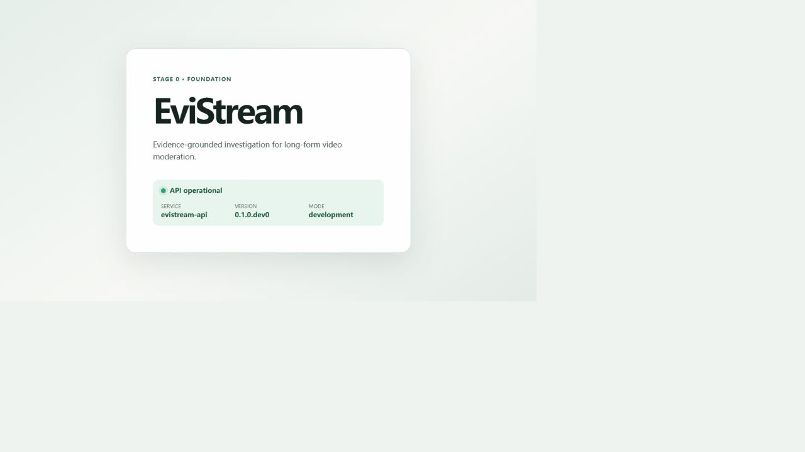

# Stage 0 验收报告

日期：2026-08-31  
分支：`stage/0-foundation`  
状态：本地与远程阶段门全部通过。

## 本地环境

- Python 3.11.16，环境名 `evistream_env`
- Node.js 24.14.0
- pnpm 11.19.0
- FFmpeg 2026-03-22 git build
- faster-whisper 1.2.1，`tiny.en`、CPU、INT8
- WSL2 Ubuntu 22.04.5 LTS
- WSL Python 3.11.16、Node.js 24.20.0、pnpm 11.19.0、FFmpeg 4.4.2
- Docker Desktop 4.88.1、Engine 29.7.2、Compose 5.4.0

项目配置和脚本没有写入上述工具的本机绝对路径。

## 已通过的检查

| 检查 | 命令或方式 | 结果 |
| --- | --- | --- |
| Python 风格 | `ruff check .` | 通过 |
| Python 类型 | `mypy evistream apps` | 通过，23 个源码文件 |
| Python 测试 | `pytest` | 28 项通过，核心覆盖率 89.73% |
| 前端风格 | `pnpm --dir apps/web lint` | 通过 |
| 前端测试 | `pnpm --dir apps/web test --run` | 2 项通过 |
| 前端构建 | `pnpm --dir apps/web build` | 通过 |
| API 进程 | 启动 Uvicorn 后请求 `/api/v1/health` | HTTP 200，Schema 与版本正确 |
| InlineExecutor | `evistream run-demo-job` | `SUCCEEDED`，共享 Handler 返回确定性结果 |
| Mock Gateway | `evistream model-smoke --profile mock` | 返回统一 `ModelResponse` |
| 兼容接口 | 本地 OpenAI-compatible HTTP 服务器 | Schema、追踪 ID、媒体格式、重试和错误映射通过 |
| FFprobe | `evistream probe-video tests/fixtures/media/stage0_sample.mp4` | 30 秒、640×360、H.264、AAC |
| Mock ASR | `evistream asr-smoke ... --backend mock` | 返回统一 `ASRResponse` |
| 真实 ASR | `evistream asr-smoke ... --backend faster-whisper` | 成功解码，返回 0–7720 ms 非空片段 |
| Linux 环境 | WSL2 Ubuntu 中执行 `make doctor` | 9 项通过，0 项失败 |
| 百炼模型 | `evistream model-smoke --profile dashscope-test` | `qwen3.8-flash` 返回统一结构 |

真实 ASR 输出保存在
[`verification/stage0-asr-tiny-en.json`](verification/stage0-asr-tiny-en.json)。Stage 0 不以
精确 WER 为门槛，因此合成语音中的轻微识别偏差不阻断验收。

百炼真实调用于 2026-08-31 完成：实际模型 `qwen3.8-flash`，耗时 2405 ms，输入 80
Token、输出 79 Token，总计 159 Token。完整的非敏感响应元数据保存在
[`verification/stage0-model-dashscope.json`](verification/stage0-model-dashscope.json)。

## 前端健康页

页面已经在真实 Vite 与 Uvicorn 进程组合下核对。默认使用同源健康接口，Vite 在开发期代理
`/api`，分离部署时可设置 `VITE_API_BASE_URL`。

## 远程 CI

- [PR #2](https://github.com/linlin-is-me/EviStream/pull/2) 的 Push 与 Pull Request
  工作流均通过。
- 两个后端 Job 均耗时 1 分 12 秒；两个前端 Job 分别耗时 20 秒和 22 秒。
- 后端完成 Ruff、mypy、pytest、Linux doctor、FFprobe 和实际 Uvicorn 健康检查。
- 前端完成 pnpm 锁文件安装、ESLint、Vitest 和生产构建。

Stage 0 的功能、兼容性、媒体、Linux 环境和远程 CI 门槛均已满足。

2026-09-01 的 Stage 0–3 收口同步修订了 README 的 Linux/WSL2 环境说明，并扩充第三方
声明，使其覆盖数据库、检索、OCR 和 ASR 的后续依赖。Stage 0 接口与验收结论不变。

## GitHub 协作项

- [M0 Foundation](https://github.com/linlin-is-me/EviStream/milestone/1)
- [Stage 0: Foundation](https://github.com/linlin-is-me/EviStream/issues/1)

## 已知限制与 Stage 1 前置条件

- CI 只运行 Mock Gateway 和本地兼容服务器，不访问外部模型，也不下载 ASR 模型。
- 兼容 Gateway 接受 URL 或 Data URI 媒体引用；本地文件编码与对象存储上传留到后续阶段。
- Stage 1 开始前需先完成远程 CI 和 PR 合并，再引入 PostgreSQL、Redis 与 RQ。
